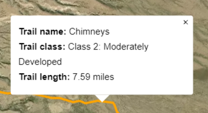
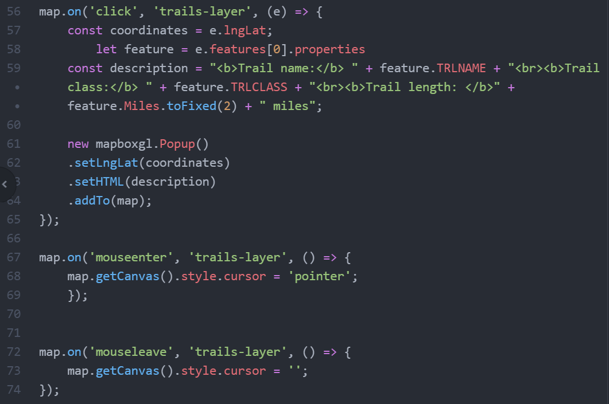

# Lab 1: Interactive mapping with Mapbox GL JS

## TGIS 504, Winter 2022, Dr. Emma Slager

### Introduction 

Thus far in the program, we've been making our interactive maps with Leaflet. Another powerful mapping framework for interactive mapping is Mapbox GL JS (GL stands for Graphics Library and JS for JavaScript), made by the same company whose basemap tiles we've already used with Leaflet. This lab introduces you to Mapbox GL JS, including:

* how to initialized and render a map in an HTML page
* how to add GeoJSON data to a map and style it based on data properties
* how to add map elements like clickable pop-ups and a legend
* working with 3D data (one of Mapbox's strengths compared it other web mapping frameworks)

Your final output will include a map that demonstrates your ability with all of the above, hosted on GitHub Pages. 

### Set up your workspace 

Begin by creating a new folder to hold your Lab 1 work, and create your HTML, JS, and CSS files using Atom and/or your computer's file management system. These files should be blank for now, and we will add content in the steps below. Add the following boilerplate code to your index.html file: 

```html
<!DOCTYPE html>
<html>
<head>
    
</head>
<body>

</body>
</html>
```

Eventually, you will upload the files to GitHub, so you may wish to create a repository for your files now, which also provides the benefit of serving as a backup for your work. As always, I recommend saving your work frequently and testing it regularly using atom-live-server or a similar Atom package. 

### Step 1: Initialize and render your map

The basic steps for adding a map to a web page are very similar between Leaflet and Mapbox: 	

1. Include links to the Mapbox libraries in the `<head>` of your HTML file;

2. Create a `<div>` to hold your map, and set some basic style parameters for it; 
3. Use the methods built into the Mapbox JS library to initialized the map, add basemap tiles, and set the initial center and zoom. 

Begin by adding the following links to the Mapbox libraries in your HTML `<head>`. Note we are using a CDN, as usual, to host the libraries:

```html
<script src='https://api.mapbox.com/mapbox-gl-js/v2.6.1/mapbox-gl.js'></script>
<link href='https://api.mapbox.com/mapbox-gl-js/v2.6.1/mapbox-gl.css' rel='stylesheet' />
```

While you're at it, add a link to your own CSS stylesheet. Next, complete the following: 

* in the body of your HTML file, create a `<div>` element with `id` set to 'map'
* still in the HTML body, add a link to your JS file below where you declare the map `<div>` 
* in your CSS stylesheet, set the dimensions of your `map` div to `width: auto;` and `height: 98vh` (consult CSS reference documentation if you've forgotten the id selector or other CSS syntax over Winter break!)
* In your JS file, include the following:

```javascript
mapboxgl.accessToken = '{accessToken}'
const map = new mapboxgl.Map({
container: 'map', // container ID
style: 'mapbox://styles/mapbox/satellite-v9', // style URL
center: [-103.2502, 29.2498], // starting position [lng, lat]
zoom: 9 // starting zoom
//pitch: 85,
//bearing: 80, 
});
```

Notice a few things about this JavaScript code: 

1. You must replace `{accessToken}` with your own Mapbox access token. Retrieve this from your Mapbox account online and make the replacement now. 
2. We're using `const` instead of `var` (which we tended to use with Leaflet) for the `map` declaration when we initialize the map. We've discussed the difference between these before, but remember that they are functionally similar. Mapbox used to use `var` in its tutorials but has recently switched to `const`, matching more common JS best practices. For our purposes, either is generally fine, but using `var` can sometimes result in unintentional bugs, because `var` values can be redefined, while `const` values cannot. For more information, [see this link](https://www.freecodecamp.org/news/var-let-and-const-whats-the-difference/). 
3. The `containter` parameter is referencing the `div` you declared in your HTML.
4. The `style`, `center`, and `zoom` parameters should be very familiar from past maps you've made with Leaflet. 
   * Style urls can be to default [Mapbox styles](https://docs.mapbox.com/api/maps/styles/#mapbox-styles) or any custom styles you've created in Mapbox Studio. 
   * Note that the coordinates for the map center are listed in LONGITUDE, LATITUDE order, and, as usual, they are specified as decimal degrees in the WGS84 unprojected coordinate system. While there are exceptions, when working with Mapbox, you should format coordinates as LNG, LAT, not the more familiar LAT,LNG. [More info here](https://docs.mapbox.com/mapbox-gl-js/api/geography/#lnglat). 
   * Documentation for the Zoom level (which can rage from 0-22) is [available here](https://docs.mapbox.com/help/glossary/zoom-level/).
5. Leave the `pitch` and `bearing` parameters commented out for now. We'll come back to that in Step 4. 

Save all your changes, start your Atom live server (or open your index file in a browser) and preview the changes. You should see a map filling most of your screen, centered on Big Bend National Park, with the Mapbox satellite basemap. If you don't see this, check the JS console and examine your code to identify and fix any typos or other issues before moving on. 

### Step 2: Add GeoJSON data to your map and style it

The process for adding GeoJSON data to a map with Mapbox is similar to that in Leaflet; it is a two-step process where we first add the data, then add it as a layer on the map. This is done asynchronously (remember AJAX?), but we do not need to link to the JQuery library separately as we did with Leaflet, because AJAX functionality is built into the Mapbox library already. 

We'll be adding two layers, one that shows the boundary of Big Bend National Park, and one that shows hiking trails in the park. Test your data-finding skills by searching the Internet to find these files yourself (they are both available already formatted as GeoJSONs). If you've searched and given up, see the end of these instructions for the links directly to the sources. 

Save these in your lab folder (I recommend creating a 'data' subfolder). You will host a copy of the data locally for this lab. Examine the files in Atom and note that the boundary file contains one GeoJSON feature of type Polygon, while the trails file contains many features of type MultiLineString. The features in both files contain numerous non-spatial properties, like the names and lengths of the hiking trails. Quickly test your ability to read a GeoJSON file: What is the name of the first feature listed in the Trails GeoJSON? (See the end of these instructions for the answer.)

Next, we'll add an event listener that will execute a function when the map has finished loading. Then, we'll write the function that will add the data and then display it as a layer on the map. First, the listener. Copy the following at the bottom of your JS scripts file: 

```javascript
map.on('load', () => {

});
```

What's going on here? The map listener is waiting for the map to load, with the style, center, and zoom options we specified before. This happens quickly, but we need the browser to wait until the process is complete before we can add our data layers asynchronously. 

The next part of the code, `=>`, is a shorthand way of writing a function expression. You may have encountered it in tutorials you've found on your own in the past, but it is likely unfamiliar to most of you. It replaces the `function` keyword in much modern JavaScript code. I've included it here so that you will be familiar with it, but you are welcome to continue writing your functions with the `function` keyword if you prefer. You can [read more about arrow function expressions here](https://developer.mozilla.org/en-US/docs/Web/JavaScript/Reference/Functions/Arrow_functions). 

The area between the curly brackets `{ }` is where we'll add the next bit of code: 

```    javascript
    map.addSource('trails', {
        type: 'geojson',
        data: 'data/Big_Bend_Trails.geojson' // note, you'll have to change this if your data file is saved under a different name or not in an enclosing folder named 'data'
    });

    map.addLayer({
      'id': 'trails-layer',
      'type': 'line',
      'source': 'trails',
      'paint': {
          'line-width': 3,
          'line-color': 'red'
      }
    });
```

Save these changes and preview the map. You should now see the park trails layer, displaying as thick red lines. (If you don't, you may need to change the URL for the data in the `map.addSource` section of the code, as explained in the commented out code.) As explained before, there are two chunks of code here, each utilizing a method that is built into the Mapbox GL JS library: the first loads the data from the specified location (a URL), and the second adds that data as a layer to the map. We name the source `'trails'` in the first chunk of code so that we can reference it in the second chunk of code. We name the layer `'trails-layer'` so that we can reference it later to do things like add pop-ups, etc. 

In the `map.addLayer` section of the code, we specify that this data should be displayed as the line type. Other layer types that Mapbox allows include "fill" (polygon), "symbol" (icon), "circle" (circle marker), "heatmap", "fill-extrusion" (3D shapes), "raster", "background", and "sky". You can [read more about these types here](https://docs.mapbox.com/mapbox-gl-js/style-spec/layers/#type). We also use the `'paint'` property to add styling to the layer. Styling options vary according to data type. Find [the options for styling lines with 'paint' here](https://docs.mapbox.com/mapbox-gl-js/style-spec/layers/#line), and use the menu on the right side of the screen to see the options for other data types. 

Still inside the same set of curly brackets, add another two chunks of code to add the boundary file to the map: 

```javascript
	map.addSource('bounds', {
        type: 'geojson',
        data: 'data/BigBendBounds.geojson'// note again, you may need to change this. 
    });

    map.addLayer({
      'id': 'boundary-layer',
      'type': 'line',
      'source': 'bounds',
      'paint': {
          'line-width': 4,
          'line-color': 'black',
          'line-opacity': .6
      }
    });
```

Save and refresh to examine the changes. You should see a thick black line around the boundary of the park now. Note that even though the GeoJSON for the boundary file indicated the feature here was a polygon, we are able to display it as just an outline by setting the type to 'line'. Mapbox doesn't allow us much ability to style polygon interiors differently than their outlines, so if you want a transparent polygon with a visible outline, this is the way to achieve it. 

#### 2.2: Data-driven styling

Data-driven styling with Mapbox is a bit unusual. Rather than using ordinary JavaScript conditional statements, you have to write Mapbox-specific "*expressions*" to style your layers based on properties stored in the GeoJSON. [Read about them here in the documentation](https://docs.mapbox.com/mapbox-gl-js/style-spec/expressions/). 

Recall that there were many properties in the Trails GeoJSON that could be useful for styling. In particular, let's style the trails categorically based on the "TRLCLASS" (or [trail class](https://www.nps.gov/gis/trails/documents/Appendix_A.htm)) property. There are 3 classes represented by the trails in our data set: 

* Class 1: Minimally Developed
* Class 2: Moderately Developed
* Class 3: Developed

We'll style these so that Class 1 trails are red, Class 2 trails are orange, and Class 3 trails are yellow. Replace the `'line-color': 'red'` line in your code with the following: 

```javascript
          'line-color': ['match', ['get', 'TRLCLASS'],
              'Class 1: Minimally Developed', 'red',
              'Class 2: Moderately Developed', 'orange',
              'Class 3: Developed', 'yellow',
              /*else,*/ 'blue'
          ]
```

Let's take this apart piece by piece to understand what's going on. The first expression we use is 'match'. We use this to specify that we want to match a named value to a specific color. So what are the named values and what are the colors we're matching? We specify that with the 'get' expression: We 'get' 'TRLCLASS' (the property name where our trail classes are stored), then match the possible values from that property with the colors we wish to display them as. Finally, we list one backup color, 'blue', for any values that don't match. 

Save your changes and open the browser to see the effect this has. You should now see trails displayed as red, orange, or yellow, based on their stated class:


### Step 3: Adding pop-ups and legend

#### 3.1 Pop-ups

Adding pop-ups to layers in Mapbox is similar to doing so in Leaflet, and by now, you should know enough JavaScript and HTML to be able to make sense of code samples and documentation to achieve this task on your own. So for this part of the lab, add pop-ups to the **trails layer**, including in the popup the **trail name**, **trail class**, and **length in miles**. You should format your pop-ups with selective bolding and line breaks to make them maximally readable, and you should display the length in miles with just two decimal places. Don't forget to include units on the trail length! When  I hover over the trails, my cursor should turn into a pointer so that I know the features are clickable. The final product should look like this: 



A piece of documentation that might help is [this example from Mapbox](https://docs.mapbox.com/mapbox-gl-js/example/popup-on-click/). Note that you only need to use a portion of the example code. 

*Some hints and reminders:* 

* To ensure that you reference the correct property names, you may find it helpful to open the trails GeoJSON in Geojson.io, then view the Table view of the file. 
* Some of the modifications you need to make to the Mapbox example code include:
  - referencing the correct layer name
  - referencing the correct property names
  - changing what `const coordinates` references

* If you are very stuck, you can find an image (but it can't be copied and pasted) of what your code could/should look like at the end of these instructions. 

#### 3.2 Legend

Building a legend in Mapbox GL JS is similar to doing so in Leaflet, which is to say, more complicated that it feels like it ought to be.  

There are two main components to this, which happen in the HTML file and the CSS file: 

1. Create a `<div>` in the HTML and fill it with the appropriate content
2. Style the legend div in CSS to ensure it is readable and looks professional

Let's start with the HTML. In your index, copy the following below the 'map' `<div>`: 

```html
    <div id='legend'>
        <h4>Big Bend NP Trails</h4>
        <ul>
            <li><hr class="class1"> Class 1 trail: Minimally Developed</li>
            <li><hr class="class2"> Class 2 trail: Moderately Developed</li>
            <li><hr class="class3"> Class 3 trail: Developed</li>
            <li><hr class="boundary"> Park boundary</li>
        </ul>
    </div>
```

This will add some content below the map. We'll adjust its placement with CSS in a moment. For now, notice that we've created a div to hold the legend, and included a title and an unordered list of legend items inside that div. The `<hr>` element stands for "horizontal rule," and it is more commonly used in HTML to provide a stylistic break between text paragraphs. In the past, we've styled legends with `<svg>` (or "scalable vector graphics") elements, but `<hr>` works when we only have lines and is a bit simpler. Each `<hr>` element is also assigned a class, which we'll use to style the lines in the different colors of the features they represent. Next, add the following to your CSS stylesheet: 

```css
#legend {
background-color: #ffffff;
border-radius: 3px;
bottom: 30px;
box-shadow: 0 1px 2px rgba(0, 0, 0, 0.1);
font: 12px/20px 'Helvetica Neue', Arial, Helvetica, sans-serif;
padding: 10px;
position: absolute;
right: 18px;
z-index: 1;
}

#legend h4 {
margin: 0 0 10px;
}

#legend hr {
  width: 16px;
  transform: rotate(45deg);
  float: left;
  margin-right: 10px
}

#legend ul{
  list-style-type: none;
  padding: 0;
  margin: 0;
}

.class1 {
  border-top: 3px solid red;
}
.class2 {
  border-top: 3px solid orange
}

.class3{
  border-top: 3px solid yellow
}

.boundary{
  border-top: 4px solid black;
  opacity: .6
}
```

Save those changes and notice how your legend changes. It should now be located in the bottom right corner of your map, with a white background and colored lines indicating each of the features on the map. So how did we do this? Much of this styling should already be familiar to you, but some things warrant further explanation: 

* `border-radius: 3px` rounds the corners of the legend box. In Step 4, we'll add a Mapbox control that has similar rounding, so we'll style it like this to maintain visual consistency. 
* `z-index: 1` ensures that the legend appears above the map, rather than below it. 
* The `width` on the `<hr>` element defines the length of the line, while `transform: rotate(45deg)` angles it diagonally. We can adjust this to another angle if we want; by default, the line is horizontal, so 90 degrees would make it vertical, 45 makes it diagonal, etc. 
* Finally, we use CSS classes to define the colors of the lines created by the `<hr>` elements. 

If the legend appears as expected, you may make further adjustments to it to suit your tastes, or move on to the next section. 

### Step 4: Working with 3D data

Great news: I've saved the best part of this lab for last. One of the huge advantages of Mapbox GL JS version 2 (released in December 2020) is that it makes certain kinds of interactive 3D mapping easy and beautiful. In particular, it includes a built-in terrain layer that models land elevation across the entire globe and can even model building heights in some locations. Data sources for the model are varied, and you can read more about [the elevation tilesets here](https://docs.mapbox.com/help/troubleshooting/access-elevation-data/). 

Since we're mapping hiking trails in a mountainous terrain, it may be fun to visualize our data in 3D, no? To achieve these, we'll add two more data layers and a control to help the user adjust their view. 

#### 4.1 Rendering the terrain in 3D

First, at the bottom of your JavaScript file, add the following: 

```javascript
map.on('load', function () {
   map.addSource('mapbox-dem', {
       "type": "raster-dem",
       "url": "mapbox://mapbox.mapbox-terrain-dem-v1",
       'tileSize': 512,
       'maxzoom': 14
   });
    map.setTerrain({"source": "mapbox-dem", "exaggeration": 1.0});
    
}
```

What we have here is another event listener that executes two functions to add a data source and then add the data from that source to the map as a terrain layer. Note: we could include everything except the first and last lines of code here inside the same curly brackets where we added our other map layers, but I've had you duplicate the event listener at the bottom of your code so that you can more easily keep track of what parts of the code are doing what. The `map.setTerrain` method is a new method for you, but it is very similar to the `map.addLayer` method that you used earlier. 

Save these changes and preview your map. Things might look a little different, but it's hard to tell. To make it easier to see what's going on, return to the very top of your JS code and uncomment the `pitch: 85,` line of code. Save, preview, and zoom in to those mountains. 

Wow! The terrain should now be rendered in 3D. The pitch option changes the user's view from straight above to a set angle (in this case 85 degrees) towards the horizon, where 90 would be standing the ground and 0 would be directly above. 

As you zoom in and out, you can see that when the scale is large (large cartographic scale = large detail), the effect is more pronounced, but when zoomed out, it is less so. Sometimes cartographers will use vertical exaggeration (VE) on terrain maps to help illustrate elevation on smaller scale maps ([read more here](http://shadedrelief.com/3D_Terrain_Maps/3dterrainmapsver.html) if you're curious). 

With Mapbox, we can adjust VE using the `exaggeration` option built into the `map.setTerrain` method. Currently, this is set to 1.0. Play around and adjust this to different values, seeing how it changes the appearance of the map at different scales. Choose something between 1-2 that gives a realistic sense of the elevation at a mix of scales, without making things appear too weird at large scales. With VE, it's generally better to err on the side of too little rather than too much, especially in such a dramatic landscape as this. 

#### 4.2 Adding sky

Notice that the top of the map is now a blank white space that the mountains jut up into. This can be a bit disorienting at first, since we never see the earth's surface without its atmosphere. Let's change that to render something resembling sky. 

After the `map.setTerrain` line of code and before the closing curly bracket `}` add the following: 

```javascript
map.addLayer({
        'id': 'sky',
        'type': 'sky',
        'paint': {
            'sky-type': 'atmosphere',
            'sky-atmosphere-sun': [0.0, 0.0],
            'sky-atmosphere-sun-intensity': 15
        }
    });
```

Save and preview your work. This layer is meant to simulate the natural scattering of light that Earth's atmosphere produces. You can leave these settings as-is, or play around with the 'paint' options to create a different effect. Find [the style specification here](https://docs.mapbox.com/mapbox-gl-js/style-spec/layers/#sky) and a tool that [uses the SunCalc library to model different times of day here](https://docs.mapbox.com/mapbox-gl-js/example/atmospheric-sky/) for tips and ideas. 

#### 4.3 Adding a control to let the user adjust their view

Whenever we're messing around with pitch, it can be useful to give the user a control to let them make adjustments themselves. This is easy to achieve. At the very bottom of your JS code, add the following: 

```javascript
const navControl = new mapboxgl.NavigationControl({
    visualizePitch: true
});
map.addControl(navControl, 'top-right');
```

Here we create a control--named `navControl`, though you could call it something else if you wanted--to the top-right corner of the map that lets the user adjust zoom, bearing (the orientation of the map in relation to North), and pitch. Find [the documentation for this control here](https://docs.mapbox.com/mapbox-gl-js/api/markers/#navigationcontrol).

As a last step, use the Mapbox documentation to add one more control to the bottom-left corner of your map: a scale control. This will let the user see the ratio of distance on the map to distance on the ground, a helpful feature when one is planning a hiking trip! Set the units to whatever measuring system you prefer. 

### What to submit

Finalize your map by adjusting the initial pitch, bearing, zoom level, and center of the map in the map options, and add a title and brief explanatory text to the page. Include citations for your data, either in the explanatory text or in the [attribution control](https://docs.mapbox.com/mapbox-gl-js/api/markers/#attributioncontrol). Upload all of your files to GitHub and submit a link to your final map in the appropriate assignment dropbox on Canvas. I'll assess your work based on completeness, code organization, and customizations requested by these instructions. You do not need to submit answers to the self-assessment questions included in these instructions. (But if you've identified any gaps in your skills or understanding through the self-assessments, please reach out to ask any questions you may have!)

*Checklist*

* Layer showing hiking trails, visualized according to trail class
* Layer showing the park boundary
* Formatted, clickable pop-ups on the trails layer
* Formatted legend
* 3D terrain layer
* Sky layer
* Navigation control
* Scale control
* Title, explanatory text, and data attribution

### Hints, answers, etc. 

1. Sources for the overlay GeoJSON files: 

   * [The park boundary file](https://hub.arcgis.com/datasets/philip::big-bend-national-park-boundary/explore?location=29.593879%2C-103.580075%2C9.09)
   * [The trails file](https://hub.arcgis.com/datasets/nps::big-bend-national-park-trails/explore?location=29.303204%2C-103.316961%2C10.05)

2. The name of the first trail in the trails GeoJSON: 'Chihuahuan Desert Nature Trail'

3. Code for the pop-ups is below. Your line numbers do not need to match mine! You may have found a slightly different way to achieve what I've done here, and that is also just fine. Note that the section of the code in the Mapbox example that has to do with 'multiple copies of the feature' is no longer relevant in the latest version of Mapbox GL JS, though including it won't hurt anything. 

   