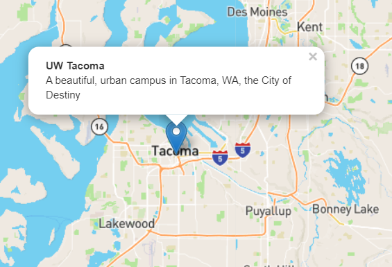

# Lab 7: Carto and SQL for back end mobile data collection

## TGIS 504, Winter 2022, Dr. Emma Slager

### Introduction

In Lab 6, you set up a data collection tool that allowed users to draw shapes on a map using Leaflet.draw and entered attribute data for those shapes using an HTML form. However, the drawn layers were not stored anywhere, just printed to the console. In addition to an input interface, to have a functional data collection tool, we also need a permanent storage location and a mechanism for writing user input to that location. In this lab, therefore, you will set up and configure a database to store user-submitted information so that it can be retrieved, displayed, and analyzed at a later time. 

*Lab 7 starter files*

* lab_7_template.geojson, which we will use to create our CARTO table. Download from Github.
* Lab 7 testing files, including an index.html file, scripts.js file, and styles.css file. We'll use these for testing out the initial Carto table you set up. Download from Github.
* Your Lab 6 files, from which you will copy your HTML form in Step 7.1 below. 

*Technology stack for Lab 7*

* Atom or another text editor for editing files
* Leaflet & Leaflet.draw libraries
* Chrome or another web browser with developer tools (JS console)
* CARTO (web interface and SQL commands)

### 1. Working with CARTO

The first step in achieving the goals of this lab is to set up the permanent storage location for the data. We will build a relational database using [CARTO](https://carto.com/), which means that what we need is an (empty) table in our database that contains columns and data types according to the data we intend to collect. 

In this week's reading, you learned about the CARTO platform and read a bit about SQL queries for spatial databases. Here in step 1, we'll set up a new table in CARTO and practice running some SQL queries. 

If you haven't already, sign up for a CARTO account using the [CARTO for Students](https://carto.com/help/getting-started/student-accounts/) process. This will give you free access to CARTO for two years. If you have trouble with CARTO for Students for any reason (for instance, if you did not receive verification through the GitHub Education Pack in a timely manner), you may sign up for the [12-month trial here](https://carto.com/signup/), but that should be used only as a backup option. With either method, we want to use the classic Carto platform, not the new Carto platform. Once you've signed up for an account, log in and visit your dashboard. 

Click the 'Data' button on the top ribbon. Click 'New Dataset', and you will be given an option to connect to a local file, a database, a cloud file, or another file. Click the GeoJSON option under 'Local files'. Use the 'Browse' button or drag & drop to upload the lab_7_template.geojson file to your CARTO account. Ensure that the lock icon on the bottom right corner of the screen is green and in the 'unlocked' position, so that your table will be publicly available. Click 'Connect Dataset.'

You should see a blank table with just two columns, 'cartodb_id' with data type 'number' and 'the_geom' of data type 'geometry'. Next, we'll modify the table using both the GUI and SQL commands. 

#### 1.1. Modify the CARTO table

First, let's add a couple of additional columns, one called 'name' and one called 'description'. These will hold the attributes that a user can set with the Leaflet.draw interface in the Lab 7 testing files. The testing files replicate a simple version of what you built in Lab 6, and produce an interface that looks like the screenshot below:

 

In Carto, click the 'Add column' button in the upper right corner of the table, and use the interface to change the name of the column to 'name', making sure it has type 'string'.

Add the second column using SQL commands instead of the GUI. In the bottom left corner of the screen, toggle from 'Metadata' to 'SQL'. This should open an SQL window that looks like this (note that some files have been renamed since I made these screenshots): 


Here we can type SQL queries to modify the table, achieving tasks like adding columns, adding or removing data, or display portions of the data that meet certain criteria. To test this out, change the SQL query from the default text shown in the screenshot above to the following: 

```SQL
SELECT the_geom FROM lab_7_template
```

Click 'Apply' to run the command. Instead of seeing all of the columns in the table, you should just see the column called 'the_geom'. Click 'Clear'.

We'll use a SQL statement to add a column. The general SQL syntax to add a column to a table is:

ALTER TABLE *table_name*
ADD *column_name datatype*;

To add a column to hold the description attribute, we will use that code, substituting in the name of our table and the name we want to give the new column, and specifying the correct data type. Copy or type the following command into the text box and click 'Apply':

```SQL
ALTER TABLE lab_7_template
ADD description text;
```

You should see the new column appear, but in certain browsers, the CARTO interface can be a bit glitchy. If the new column does not appear, try refreshing the page, or clicking 'Add column' to get it to show up. (If you add a column, be sure to delete it using the three-dot menu next to the column header before continuing.)

Note that although the CARTO interface lists the data type for the new columns as 'string', the keyword in SQL syntax is 'text'. These are synonyms, and both are familiar to you by now, but I wanted to make sure you take note of it in case you try adding other string/text columns with SQL in the future. 

Next, let's rename the table. Click the three dots next to the table name and change the name to 'lab_7_[yourname]' changing '[yourname] to your first name, without the square brackets. Click 'OK, rename it' to confirm the change.

For the curious, you can also use the following SQL command to change a table's name, but because of the aforementioned glitchiness, in this case I recommend using the GUI: 

```SQL
ALTER TABLE table_name
RENAME TO new_table_name;
```

#### 1.2. Add data to the table

Before we add data to the table using the Leaflet.draw interface, let's first add some sample data using an SQL command. Let's add a point at the location of the UWT campus, giving it the name 'UW Tacoma' and the description 'A beautiful, urban campus in Tacoma, WA'. We can use the SQL ```INSERT INTO``` and ```VALUES``` keywords for inserting new data, as shown in the query below (note that you will have to change the name of the table in the first line so that it matches the name of *your* table):

```SQL
INSERT INTO lab_7_name (the_geom, name, description) VALUES (
  ST_SetSRID(
    ST_GeomFromGeoJSON(
      '{"type":"Point","coordinates":[-122.4383461, 47.2449897]}'
    ), 
  4326
  ),
  'UW Tacoma', 
  'A beautiful, urban campus in Tacoma, WA'
);
```

After changing the name of the table in the first line of the query to match your table's name, click 'Apply' and view the change. The result should look similar to the following: 


The SQL command we used to add this data looks quite long and complex, so let's walk through it. Note first that the high-level structure used to specify the column names and values to insert looks like this: 

```SQL
INSERT INTO table_name (..., ..., ...) VALUES (..., ..., ...);
```

The first three ```...``` symbols are replaced with the column names where the values go into. The second set of `...` symbols are replaced with the values themselves. Note that the order of the column names needs to match the order of the values, so that the correct value will be inserted into the correct column. In the present example, the ordering of the first triplet (the column names `the_geom`, `name`, and `description`) matches the order of the second triplet after the `VALUES` keyword (the geometry, `'UW Tacoma'`, and `'A beautiful, urban campus in Tacoma, WA'`). 

To create the geometry value that goes into the `the_geom` column, the query makes use a function, `ST_GeomFromGeoJSON`. This function converts GeoJSON syntax (`{"type":"Point","coordinates":[-122.4383461, 47.2449897]}` in our example) into what is called Well-Known Binary, or WKB. This is a form of compression that reduces the required storage space for the database. If we were to look at the raw data that is stored for this value, instead of the long string of GeoJSON, we would see instead `010100000011f5ccdc0d9c5ec0adad8ed25b9f4740`. Note that CARTO uses an additional transformation, however, to display the geometry not in WKB but in WKT, or Well-Known Text, as `POINT(-122.4383461 47.2449897)`, which is conveniently human-readable. To explore these three formats further and convert between them, see [this online tool](https://rodic.fr/blog/online-conversion-between-geometric-formats/). 

In addition to converting GeoJSON to WKB, the query uses the `ST_SetSRID` function to specify that the GeoJSON coordinates are in lng/lat, and that they use WGS 84 coordinate reference system. The SRID in `ST_SetSRID` stands for 'spatial reference ID', and it uses the EPSG code `4326` to specify that the SRID is WGS 84. As you learned in Lab 3, [the EPSG system](https://en.wikipedia.org/wiki/EPSG_Geodetic_Parameter_Dataset) is a public registry of geodetic datums and spatial reference systems, which can all be referred to with a numeric code. 

### 2. Using the CARTO SQL API

To utilize our CARTO database with the data collection tool we built with Leaflet, we will use the [CARTO SQL API](https://carto.com/developers/sql-api/). This API allows for communication between a web browser and the database hosted on the CARTO platform. The API allows us to send SQL queries to the database via HTTP using a URL that includes the CARTO user name and the SQL query. The CARTO server processes the request and returns the data that is requested by the query in a format of choice, such as CSV, JSON, or GeoJSON. Because the API uses HTTP to send and receive data, we can send requests to the database--and get responses--using client-side JavaScript code. 

The basic URL structure for sending a request to the CARTO SQL API looks like this: 

```
https://CARTO_USERNAME.carto.com/api/v2/sql?format=FORMAT&q=SQL_STATEMENT
```

where:

- `CARTO_USERNAME` should be replaced with your CARTO **user name**
- `FORMAT` should be replaced with the required **format**
- `SQL_STATEMENT` should be replaced with the SQL **query**

For example, here is a specific query:

```
https://ejeans.carto.com/api/v2/sql?format=GeoJSON&q=
SELECT * FROM lab_7_emma
```

where:

- `CARTO_USERNAME` was replaced with `ejeans` (my username)
- `FORMAT` was replaced with `GeoJSON`
- `SQL_STATEMENT` was replaced with a `SELECT` statement that returns all of the records in the table named `lab_7_emma`

Based on the data that is currently in the table, the data that would be returned from this call would be the following GeoJSON content: 

```JSON
{
  "type": "FeatureCollection",
  "features": [
    {
      "type": "Feature",
      "geometry": {
        "type": "Point",
        "coordinates": [-122.4383461, 47.244989]
      },
      "properties": {
        "name": "UW Tacoma",
        "description": "A beautiful, urban campus in Tacoma, WA"
      }
    }
  ]
}
```

<!-- It's important to note that whenever we export the result of the query in a spatial format (such as `format=GeoJSON`), the geometry column (`the_geom` in this case) must appear in the query. Otherwise, the server cannot generate the geometric part of the layer, and we get an error. For instance, if instead of selecting `*` from the table, we selected only the columns `name` and `description` using the following API call--

```
https://ejeans.carto.com/api/v2/sql?format=GeoJSON&q=
SELECT name, description FROM lab_7_emma
```

the result would be the following error message, instead of the requested GeoJSON: 

```json
{"error":["column \"the_geom\" does not exist"]}
```

If we wanted *only* non-geographic attribute data to be returned, we could run the API call without specifying any format, and then the result would be returned in default JSON. For example, 

```
https://ejeans.carto.com/api/v2/sql?&q=
SELECT name, description FROM lab_7_emma
```

would return: 

```json
{"rows":[{"name":"UW Tacoma","description":"A beautiful, urban campus in Tacoma, WA"}],"time":0.008,"fields":{"name":{"type":"string","pgtype":"text"},"description":{"type":"string","pgtype":"text"}},"total_rows":1}
```
-->

Because the returned file is in GeoJSON format, we can import it into a Leaflet map quite easily. In the next step, we'll use a call to the CARTO SQL API to display data on our map. 

### 3. Displaying data from CARTO in Leaflet

In Atom, open the Project Folder for the Lab 7 testing files you downloaded from GitHub, and open the JavaScript file. Take a moment to familiarize yourself with the code, noting that it is very similar to the code you wrote in Lab 6, with a simpler HTML form for collecting attributes. From top to bottom, it should achieve the following: 

* initialize a map, set the default view and base map tile layer
* create an editable feature group named `drawnItems`
* instantiate a control that allows the user to draw shapes on the map
* create a function that opens a form within a popup on any shape the user draws and add an event listener to open that popup when the shape is completed
* create a function that saves data of the shape's geometry and attributes entered into the form. This data is currently printed to the console when the event listener tied to the 'submit' button on the form is triggered. 
* add a series of event listeners to control the behavior of the popup when a shape is being edited. 

The first change we will make to the existing code will be to add previously drawn shapes that are stored in the CARTO table to the map. Under the line of code where you declare the `drawnItems` variable and before where you instantiate the Leaflet.draw control (`new L.Control.Draw...`), add the following, making sure to specify your username in the `url` variable and your table name in the `sqlQuery` variable:

```javascript
var cartoData = L.layerGroup().addTo(map);
// change the url below by replacing YourUsername with your Carto username
var url = "https://YourUsername.carto.com/api/v2/sql";
var urlGeoJSON = url + "?format=GeoJSON&q=";
// change the Query below by replacing lab_7_name with your table name
var sqlQuery = "SELECT the_geom, description, name FROM lab_7_name";
function addPopup(feature, layer) {
    layer.bindPopup(
        "<b>" + feature.properties.name + "</b><br>" +
        feature.properties.description
    );
}

fetch(urlGeoJSON + sqlQuery)
    .then(function(response) {
    return response.json();
    })
    .then(function(data) {
        L.geoJSON(data, {onEachFeature: addPopup}).addTo(cartoData);
    });
```

This code does a few things. Let's look first at the top chunk of code. Here we declare a variable named `cartoData` to hold the data already in the CARTO table (as a layer group) and we add it to the map. Next we create variables called `url`, `urlGeoJSON` and `sqlQuery` to hold portions of the CARTO SQL API call, which we'll use in a moment. We don't have to store these as variables, but breaking the API call up like this makes it easy to understand and modify different parts of the call to adjust what we request from CARTO. Finally, we write a function to bind a popup to the features that will be displayed from the CARTO data. Note that the popup for each of the loaded features displays the `name` and the `description` properties, which the user will enter in the popup form when submitting drawn shapes. 

Next let's look at the second chunk of code. This uses a method that is likely new to you, namely `fetch`. 


Fetch is an HTML 5 API used for loading resources asynchronously in the web page. In this sense, it is very similar to the AJAX requests you've made with JQuery to load GeoJSONs into Leaflet maps in the past. You can [learn more about the Fetch API here](https://developer.mozilla.org/en-US/docs/Web/API/Fetch_API)--and note that it is not supported by the Internet Explorer browser at this time. 

The Fetch request we make in the code above requests the resource located at the specified parameter--in this case, the URL created by the combination of the variables `urlGeoJSON` and `sqlQuery`, or `https://ejeans.carto.com/api/v2/sql?format=GeoJSON&q=SELECT the_geom, description, name FROM lab_3b_emma`. 

The `.then()` method in the next bit of code takes the response from the Fetch request and formats it as JSON, and the next `.then()` adds the popups created by the `addPopup` function we wrote above to the map. 

Save your changes and preview in your browser. Navigate in the map to Tacoma, and you should see a point on the map with a clickable popup: 



If you don't see the point above, check your work to identify any typos or errors, using the JavaScript console to help, before moving on to the next step. 

### 4. Sending user inputs to the CARTO database 

In step 3 you displayed data *from* the CARTO database on your map; now it's time to send user inputs from your map *to* the database. 

The JavaScript code in the Lab 7 testing files contains a function called `setData` that, when the user clicks the 'submit' button on the HTML form, packages the geometry of the shape the user has drawn as a variable named `drawing`, and packages the attributes the user has entered for the name and description as variables named `enteredUsername` and `enteredDescription`. It then uses `console.log` to print these three variables to the console. Now, instead of printing the variables to the console, we want to send them to the database as values to be stored in a row. 

Replace the portion of the code inside the `setData` function shown in the screenshot below with the code in the code block below.

Replace this: 


With this: 

```javascript
   	// For each drawn layer
    drawnItems.eachLayer(function(layer) {
           
			// Create SQL expression to insert layer
            var drawing = JSON.stringify(layer.toGeoJSON().geometry);
            var sql =
                "INSERT INTO YourTableName (the_geom, name, description) " +
                "VALUES (ST_SetSRID(ST_GeomFromGeoJSON('" +
                drawing + "'), 4326), '" +
                enteredUsername + "', '" +
                enteredDescription + "')";
            console.log(sql);

            // Send the data
            fetch(url, {
                method: "POST",
                headers: {
                    "Content-Type": "application/x-www-form-urlencoded"
                },
                body: "q=" + encodeURI(sql)
            })
            .then(function(response) {
                return response.json();
            })
            .then(function(data) {
                console.log("Data saved:", data);
            })
            .catch(function(error) {
                console.log("Problem saving the data:", error);
            });

        // Transfer submitted drawing to the CARTO layer 
        //so it persists on the map without you having to refresh the page
        var newData = layer.toGeoJSON();
        newData.properties.description = enteredDescription;
        newData.properties.name = enteredUsername;
        L.geoJSON(newData, {onEachFeature: addPopup}).addTo(cartoData);

    });
```

Once again, there's a lot going on here, so let's take it bit by bit. Let's look at the part under the first comment: 

```javascript
		// For each drawn layer
        drawnItems.eachLayer(function(layer) {
        	// Code does something with each drawn layer
        });
```

The `.eachLayer` method used here allows us to iterate so that the code that follows will run for every shape that the user draws on the map. Note that the final curly bracket and parenthesis of the code closes this function, as indicated by the tabbing that aligns it with this opening line of code. 

So what does the internal function in the `.eachLayer` iteration do with each layer? Three things: 

1. **Construct** the `INSERT` query for adding a new record into the CARTO table
2. **Send** the query to the CARTO SQL API
3. **Copy** the submitted drawing to the CARTO layer, to display it on the map

Here is the code for the SQL query construction:

```javascript
        // Create SQL expression to insert layer
            var drawing = JSON.stringify(layer.toGeoJSON().geometry);
            var sql =
                "INSERT INTO YourTableName (the_geom, name, description) " +
                "VALUES (ST_SetSRID(ST_GeomFromGeoJSON('" +
                drawing + "'), 4326), '" +
                enteredUsername + "', '" +
                enteredDescription + "')";
            console.log(sql);
```
Here we've made some adjustments to what happens with the `drawing` variable, which in Lab 6 we simply printed to the console. First: **change the name of the table in the sql statement from `YourTableName` to *your* table's name.** Now that that's done, what's happening here is you're writing a SQL command to insert data into your table. This is just like what we did in part 1.2 above, only you're writing the SQL command in JavaScript instead of in the SQL interface in CARTO, and you're using variables to construct the query dynamically from user inputs. Just like before, you're converting the geometry of the shape from GeoJSON to WKB, using EPSG code 4326 to indicate that the coordinates are in WGS 84. You're also setting the values to be inserted into the `name` and `description` columns equal to what the user entered in the popup form. To help us double check our work, we're also using `console.log` to see in the browser's JS console what's being submitted to the database. 

In the code under the next comment, we actually send the data to the database with the CARTO SQL API: 

```Javascript
            // Send the data
            fetch(url, {
                method: "POST",
                headers: {
                    "Content-Type": "application/x-www-form-urlencoded"
                },
                body: "q=" + encodeURI(sql)
            })
            .then(function(response) {
                return response.json();
            })
            .then(function(data) {
                console.log("Data saved:", data);
            })
            .catch(function(error) {
                console.log("Problem saving the data:", error);
            });
```

Notice again that we are using Fetch, and that we are connecting to the URL you specified with the `url` variable in step 3. In my case, the URL is `https://ejeans.carto.com/api/v2/sql`, and for you, it will be the URL that contains your CARTO username. We use the `POST` method (an HTTP method for sending data to a server; [documentation available here](https://developer.mozilla.org/en-US/docs/Web/HTTP/Methods/POST)) to send the data, properly formatted and encoded. The remaining parts of the code (the `.then()` functions and the `.catch` function) log some additional information to the console to help us notice and resolve any errors. 

Finally, let's look at the code under the last comment: 

```javascript
        // Transfer submitted drawing to the CARTO layer 
        //so it persists on the map without you having to refresh the page
        var newData = layer.toGeoJSON();
        newData.properties.description = enteredDescription;
        newData.properties.name = enteredUsername;
        L.geoJSON(newData, {onEachFeature: addPopup}).addTo(cartoData);
```

This part of the code transfers the drawn data to the `cartoData` layer to display it on the map without reloading the map. Basically, the drawn `layer` is translated to GeoJSON, combined with the `name` and `description` properties, then added on the map with `L.geoJSON`. Without this part, our drawing would only be sent to the database without being shown on the map, unless we reload the web page. 

Save your changes and preview in the browser. Draw a shape on your map, enter some attribute information for the name and description, and click submit. Your shape should persist on the map; this is great! Next let's check the JS console to make sure the data was submitted to the database. 

Logged to the console, you should see an SQL statement with the geometry of the shape you drew and values for the non-spatial attributes based on what you entered in the form. However, you probably also see a 403 error. If you expand the warning message, it likely tells you 'permission denied for table lab_7_name', like this: 


Alas! This means the next step is to update permissions on the CARTO table. 

### 5. Updating permissions on the CARTO table

Any database is always associated with one or more database users, who are granted a specific set of privileges. When you set up your ArcGIS Online database for the Collector map you made in Lab 4, you granted 'Add,' 'Delete', and 'Update' privileges to members of your MSGT cohort, for instance. We typically talk about database user privileges in terms of various roles. For example, an administrator may have the maximal set of privileges, meaning they can do anything in the database: reading and writing into tables, creating new tables, deleting existing tables, adding or removing other uses, and so on. On the other hand, a read-only user may have a more limited set of privileges so that they can only consume data from the database but cannot make changes to any tables. 

The way you've accessed your CARTO database with the CARTO SQL API implies a database connection with the default user named `publicuser`, which is automatically created by CARTO when you set up your account. The `publicuser` has **read** permissions on all tables in your database, which is why you can execute the SQL query starting with `SELECT` in step 3 to display data from the database in your map. However, the `publicuser` does not, by default, have **write** permissions that would allow them to modify the table. This is why the above `INSERT` query failed with a `"permission denied"` error. 

In addition to `public user`, CARTO defines an API Key user, who has all possible privileges on the tables in the database--read, write, update, create, delete, and so on. To use the CARTO SQL API with the “API Key” user, we need to supply an additional `api_key` parameter in our query, as in:

```javascript
https://ejeans.carto.com/api/v2/sql?q=
INSERT INTO lab_3b_emma (the_geom, name, description) 
VALUES (ST_SetSRID(ST_GeomFromGeoJSON(
'{"type":"Point","coordinates":[34.838848,31.296301]}'
),4326),'test','test')&
api_key=fb85************************************
```

You're familiar with API keys from your work with Mapbox. You can get the API Key from your account settings panel in the CARTO web interface. So, there are two possible solutions to the "permission denied" problem when trying to insert a new record into the table: we can either connect to the database as the API Key user, who already has permissions to edit the table, or we can grant the `publicuser` a new privilege, for running `INSERT` queries on the lab_7 table. 

The first option may seem the most convenient, since the only thing we need to do is locate our API Key string in the CARTO interface and attach it in the SQL API query URL, as shown above. However, there is a serious security issue we need to consider when using this approach. If we include the API Key in our JavaScript code, in principle anyone looking into the source code of our page will be able to copy the API Key and use it to make any kind of SQL query on our account. For example, they could permanently delete any table in our account using the `DROP TABLE` command. Exposing the API Key in *client-side* scripts is therefore a serious security risk. The API Key is really intended only for *server-side* scripts, whose source code cannot be accessed by the web page users. For instance, the server-side script may accept requests with a password the user entered; if the password is valid the server can make a query to the CARTO SQL API and send back the result, otherwise the query will be rejected. This approach requires setting up a dynamic server, which means that, to use it securely, the API Key solution is not so simple after all. 

For a simple crowdsourcing app, intended for a trusted audience, the second option of granting `INSERT` privileges to `publicuser` is a simple and effective solution. In a way, this makes our database exposed: anyone who enters our web page will be able to insert new records into the table. On the other hand, the worst-case scenario is just that our table will be filled with many unnecessary records. The only privilege we will grant is `INSERT`, which means that `publicuser` cannot delete any previously entered records or modify the table in any other way. Moreover, when the URL for our page is shared with a trusted audience, such as among students taking a survey in a class, the chances of someone taking the trouble of finding our page and intentionally sabotaging our database by filling it with a large amount of fake records is very small. Thus, in small-scale use cases, the effort of making a dynamic server with an authentication system may be superfluous, since the simple solution presented below is sufficient.

To grant the permission for making `INSERT` queries on the table, the following SQL query needs to be executed. The `publicuser` obviously does not have the permission to grant themself with additional privileges. Therefore the query needs to be executed inside the **SQL editor** on the CARTO web interface, which implies full privileges, or using the SQL API with the the API Key. We'll use the CARTO web interface. 

Return to your CARTO account and open your lab_7 table. Toggle on the SQL editor, and run the following command, being sure to change the name of the table to match **your** table's name: 

```sql
GRANT INSERT  
  ON lab_7_name 
  TO publicuser;
```

Return to your map in the browser window and refresh the page. Try again to draw a shape, add some attribute values, and click submit. Check the JS console to see if you have gotten a permissions error. 

It is very possible that you have again received an error, but a different one this time. For instance, my error this time reads `["permission denied for sequence lab_3b_template_copy_cartodb_id_seq0"]`. 


The cause for this is a software defect in the database system that Carto relies on. If you receive this error as well, run the following command in the CARTO SQL editor, being sure to replace the name of the sequence with the exact name given in **your** error message, e.g.: 

```SQL
GRANT USAGE ON SEQUENCE lab_3b_template_copy_cartodb_id_seq0
  TO publicuser;
```

Return once more to your map in the browser window and refresh the page. Try again to draw a shape, add some attribute values, and click submit. Check the JS console to see if you have gotten a permissions error. This time, instead of an error, you should see a message stating that the data was saved: 


Now return to your table in the CARTO web interface. You should see a new row added to your table with the geometry and attributes you just entered on the map and form: 


Success! The database is now ready to receive data collection entries. Feel free to experiment with adding more shapes and refresh your CARTO table to see them added to the database. You can always delete rows that you do not want to keep by clicking the three vertical dots next to any of the row's values and selecting 'Delete this row...'

If at some point in the future you wanted to disable the ability for a `publicuser` to insert data into the table, for example when data collection is completed and we do not want to accept any more entries, you can always **revoke** the privilege granted to `publicuser` as follows:

```sql
REVOKE INSERT ON TABLE table_name
  FROM publicuser; 
```

### 6. Setting up a table for your Lab 6 data collection scenario

Up to now, we've been working with a table designed to work with the simplified attribute collection form in the Lab 7 testing files. However, in lab 6, you created a more complex HTML form for collecting attributes specific to your own data collection scenario. In this step, you'll repeat the actions in steps 1-5 to create a new table to hold the data users will collect with the tool you built in lab 6. 

Back in your Carto dashboard, create a new dataset and re-upload the template file. Then, set up your table with all the necessary columns to hold the data your form will collect. You will need: 

1. a 'cartodb_id' field, which should be automatically generated when you create the table
2. a 'the_geom' field to hold the geometry of each shape the user draws, which should be created when you upload the template file
3. a field for each input in your form, which you have to create. You must select the data type for each field (number, string, data, or boolean), so ensure that it matches the data type collected by the given input. 

Ensure that your table's privacy settings are set to Public so that it can be accessed via the CARTO SQL API, and grant INSERT privileges on the table to the publicuser. 

### 7. Update your HTML and JS code to connect the form to the table. 

#### 7.1 Copy your files and update your HTML form

Before continuing, save a copy of the Lab 7 testing files that you've been editing, putting them in a new folder with a name of your choosing. You'll keep a version of the files that you edited in steps 1-5 of this lab as a backup for your reference, but in this step, you'll make some additional, significant changes that warrant a saving a new version. 

Next, replace the section of the code that creates the HTML form in the popup that opens on each feature with the form you created in Lab 6. This means you will replace the following: 

``` javascript 
function createFormPopup() {
    var popupContent =
        '<form>' +
        'Description:<br><input type="text" id="input_desc"><br>' +
        'User\'s Name:<br><input type="text" id="input_name"><br>' +
        '<input type="button" value="Submit" id="submit">' +
        '</form>' 
    drawnItems.bindPopup(popupContent).openPopup();
}
```

with the longer form you wrote to go into the `createFormPopup()` function in your Lab 6 files. Save your work and test your file to ensure that the form appears as expected when you finish drawing a shape. Do not worry about what happens when you click the 'submit' button yet, as you'll fix that next. 

#### 7.2 Update your JS

Next, update your JS file to connect the form to the table. Recall that there are a couple of places in the code that determine how the form and the table interact, both within the `setData(e)` function:

1. Where we select by element ID to get the values the user entered and store those values in variables. In Step 1-5 above, for instance, this looked something like this: 

   ```javascript
           var enteredUsername = document.getElementById("input_name").value;
           var enteredDescription = document.getElementById("input_desc").value;
   ```

2. Where we write the SQL expression that inserts data into the table. In Steps 1-5, this looked something like this: 

   ```javascript
               var drawing = JSON.stringify(layer.toGeoJSON().geometry);
               var sql =
                   "INSERT INTO lab_7_name (the_geom, name, description) " +
                   "VALUES (ST_SetSRID(ST_GeomFromGeoJSON('" +
                   drawing + "'), 4326), '" +
                   enteredUsername + "', '" +
                   enteredDescription + "')";
               console.log(sql);
   ```

Update each section of the code here to link your table to your form. This should involve the following:

* Creating a variable for each value that the user inputs and selecting by input ID to access those values. (i.e. update the code in #1 above. You also did this in Lab 6 so that you could log the data to the console, so feel free to copy and paste the appropriate code from your prior work, or recreate it here.)
* Changing the table name (i.e. lab_7_name) and columns (i.e. name, description) referenced in the `INSERT INTO` command to match the name of your newly created table and its columns
* Changing the variables in the `INSERT INTO` command to match the variables that are holding the input values (i.e. swap enteredUsername and enteredDecription for the variables that hold your form's values). 

Save your changes and test them in the browser. You should be able to draw a new shape, fill in the form, and post the data to CARTO without any errors being logged to the console. Using the CARTO web interface, check your table to see if the data was saved. Update permissions for the `publicuser` as needed, using the same process as you used in step 5.  

#### 7.3 Ensure that drawn shapes persist on the map

At this point, your data collection tool (the map) should be sending user-submitted data to the data base. However, in testing, you probably noticed that the shapes the user draws are not persisting on the map. To fix that, we need to make three small changes. First, toward the top of your code, update the variable `sqlQuery` so that it is selecting from the correct table (the exact name must match the name of the table you created in step 6, rather than the table we tested with in steps 1-5). You can use * to select all columns, or name just specific columns that you want to display, e.g.:

```javascript
var sqlQuery = "SELECT * FROM step6_table_name";
```

Immediately below that line in the code, you should see a function named `addPopup`. This bit of code is pulling attributes from the GeoJSON that is exported from the CARTO table to display in each feature's popup. Change the content of that popup by pulling different properties that match the column names in your new table, e.g. replacing `feature.properties.name` and `feature.properties.description` in the example below with whatever properties you wish to display in your popups: 

``` javascript
function addPopup(feature, layer) {
    layer.bindPopup(
        "<b>" + feature.properties.name + "</b><br>" +
        feature.properties.description
    );
}
```

Finally, towards the bottom of your code (within the function named `setData`), you have a few lines of code that transfer any drawings the user has made in the current session to the layer called `cartoData` so that they persist on the map without the user having to refresh the page:  

```javascript
  var newData = layer.toGeoJSON();
    newData.properties.description = enteredDescription;
    newData.properties.name = enteredUsername;
    L.geoJSON(newData, {onEachFeature: addPopup}).addTo(cartoData);
```

Change the content of this code block so that it is also displaying the properties you want to show up in a popup, similar to what you changed in the `addPopup` function above. 

Save your changes and check your work, using the JavaScript console to help you trouble shoot any issues that arise. 

### 8. Submission

Upload your completed map to GitHub and submit a link to your work on Canvas. You need only provide a link to your data collection tool (the map), not to your CARTO database. You've accomplished quite a lot in this lab, so there is no write-up for Lab 7.