# Lab 8: Setting up your workspace to build a hybrid mobile app

## TGIS 504, Winter 2022, Dr. Emma Slager

### Introduction

So far in the program we have been building interactive maps that we have deployed on the web. Though we have incorporated mobile design principles into our work, we have not yet built tools that can be deployed directly as apps on mobile devices, only those that can be viewed on mobile web browsers. Though mobile-friendly web development has many strengths and applications, there remain some functions that can only be achieved when we develop for mobile platforms directly, for instance, offline functionality. Therefore, in this lab, we use Apache Cordova to wrap an HTML/JavaScript application into a native container so that it can be launched as an app. We will develop for the Android platform (testing via an Android device emulator on our desktop computers), because Android's security protocols make that platform more accessible than iOS. 

As a rule, the barriers to entry for mobile app development are higher than they are for web development. To begin developing for web, all we needed was a text editor like Atom and a web browser to test our work. To begin developing for Android mobile, we need a software development kit (SDK), Java Development Kit (JDK), and some additional tools, plus a device emulator for testing. Thus, our work with Cordova is divided into two labs. In Lab 8 you will download and configure a number of new softwares to enable you to build an app with Cordova, and in lab 9, you will carry out the build to package the data collection tool you built in Labs 6-7 as an Android app, test your product, and package it to share with the instructor. 

The instructions in this lab are based off of Cordova's documentation, available in [its original form here](https://cordova.apache.org/docs/en/latest/guide/cli/index.html). The exact steps of this lab will depend on your computer's operating system. I have attempted to include instructions for both Windows and OS X below, and although my screenshots will be taken on Windows, I am familiar with both operating systems. It is likely that you will run into some unexpected problems on this lab, as you are configuring settings that will be unique to your device. That likelihood is why I have split this lab into two parts. I encourage you to actively reach out to me for help, to collaborate with peers who are working your same OS, and to use online reference documentation and user message boards to help troubleshoot.

*Technology stack for this lab*

* Node.js (a JavaScript runtime that we'll use to install Cordova)
* Cordova command-line interface (CLI)
* Java Developer Kit (JDK) 8
* Android Studio (software development kit, or SDK)
* Gradle (an automation tool that Cordova requires)

### 1. Installing (NodeJS to install) Cordova

We will install Cordova using NodeJS, a node package manager that which you've used previously in lab 3 when working with OpenLayers. Cordova can only be installed via npm. 

Hopefully, you still have NodeJS installed from earlier in the quarter, but if you've uninstalled it or are working on a new machine, start by downloading the version of NodeJS appropriate for your operating system (Windows, OS X, or Linux) here: https://nodejs.org/en/. Download the installer for 64-bit version of 16.14.0 (this should be the default at the link above), and install it to your computer. 

Once you've installed NodeJS, you will be able to invoke `node` and `npm` commands on your computer's command line interface. This is how we will install Cordova. 

Open your computer's command prompt. 

* On Windows, enter the following command (and hit enter): 

  ```npm install -g cordova```

* On OS X and Linux, enter the following (and hit enter): 

  ``` sudo npm install -g cordova```

On my Windows computer, for instance, this looks like the following: 

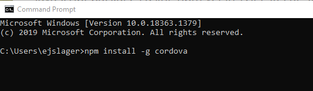

As a reminder of how npm works, it is both an interface in the command line (i.e. it gives us access to a library of command prompts that we reference with the 'npm' keyword) and an online registry of software packages. When we install a software through npm, we are directing the computer to both download the program files and install them. After the installation is complete, test your installation by entering `cordova` in the command line. This should print help text. If it does not, check any error messages and attempt the install again. 

### 2. Create a directory to hold your project and add the Android platform

Use your file manager to create a folder in your usual workspace to store your lab 8 files (or, if you remember how to do so from lab 3, you can do this in the command line with the `mkdir` prompt). Use the command line to navigate to the folder on your computer where you are storing your lab 8 files. Use the `cd` prompt (Change Directory), followed by the path name to your folder. For instance, for me on Windows, this looks like the following: 

````
cd  C:\Users\ejslager\Documents\TGIS504\2022Winter\labs\lab8
````

Now that you are working in your lab 8 directory, use the following command to create a Cordova project folder named 'hello':

```cordova create hello com.example.hello HelloWorld```

For me, this looks like the following: 

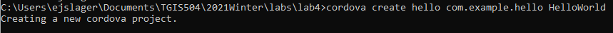

To check that this was successful, navigate in your file manage (Windows file explorer or OS X Finder) to your lab 8 folder. You should see that it contains a new folder called 'hello', which contains four items: 

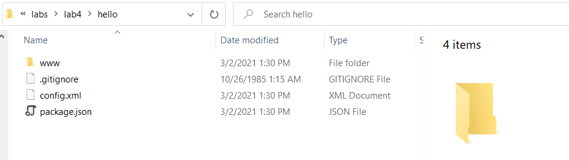

You have created the required directory structure for your Cordova app. By default, the `cordova create` script generates a skeletal web-based application whose home page is the project's www/index.html file. You could name this directory folder something other than 'hello' by changing the folder name after the `cordova create` command, but we'll use the hello world examples for now as we get set up. 

All subsequent commands need to run within the project's directory (in this case, the hello folder). Change your directory with the following command prompt: 

```cd hello```

Now, add the platform that we will build our app for, Android, using the following command: 

```cordova platform add android```

Check that all went as expected with the following command: 

```cordova platform ls``` 

You should see the following:

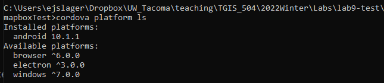

What this command did was add another sub-folder to the `hello` folder, called `platforms`, which contains a number of files that will be necessary for us to build an app for the Android platform. If we wanted to build for the iOS platform, we could also add the files needed for that, using the command `cordova platform add ios`. However, since we will only be developing for Android in this lab, we'll save space and time by not downloading the unnecessary iOS files. 

### 3. Install required software for Android development

To build and run apps, you need to install SDKs for the platform you wish to target. For Android, this means we'll need the Android Studio SDK, Java Development Kit (JDK) 8, and Gradle. 

To check if the necessary software is already installed on your machine, run the following command prompt: 

```cordova requirements```

In the very unlikely scenario that you already have all of these installed, the following will be printed to the command line interface: 

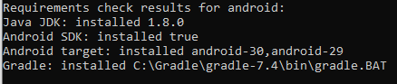

More likely, however, you will need to install Java JDK, Android SDK, and Gradle. You will also have to install an Android target (device emulator), which we will do through the Android Studio software. 

#### 3.1. Install Java JDK 8

First, if you do not already have Java JDK 1.8.0 installed (other versions *will not* work! Read the requirement results on your command interface carefully to see what, if any, version you already have installed) visit the Oracle site to download the version of [Java JDK 8](https://www.oracle.com/java/technologies/javase/javase-jdk8-downloads.html) appropriate for your operating system. For Windows users, I recommend you download the 64-bit version rather than the 86-bit version, and my screenshots in the proceedings steps will be based on that version. 

After you download the file, run the installer to install the software, following its prompts. 

#### 3.2 Install Gradle

As of Cordova-Android 6.4.0, Gradle is now required to build Android. We won't use the Gradle interface directly, but it is necessary to install. You should install Java JDK 8 *before* installing Gradle. 

Unfortunately, Gradle does not come with an installer (an .exe or .dmg file), and it is not available on the Node.JS package manager, so the install is a little more complicated than most software. You should follow the download and installation instructions under the 'Installing manually' header [on this page](https://gradle.org/install/#manually). Follow steps 1 and 2 to download and unpack the distribution files, but stop short of step 3 ('Configure your system environment') for now. Installing the Binary-only version is sufficient and will take up less space on your machine than the Complete version, so I recommend installing the Binary-only, but either is fine. 

#### 3.3. Install Android Studio SDK and Android Virtual Device

Visit [this page](https://developer.android.com/studio/index.html) to download and install Android Studio in the version appropriate for your operating system. Run the installer to install the software, following its prompts. When given the option to choose components, install both Android Studio **and** the Android Virtual Device:

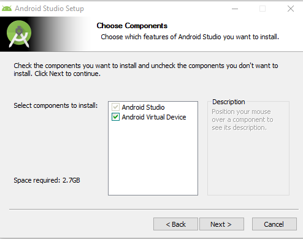

Once the install is complete, you must also install an Android Virtual Device (AVD), which is a mobile device emulator that you can use to test your work. In Android Studio, click the three vertical dot menu > 'Virtual Device Manager', or Configure > AVD Manager (the interface varies slightly between versions and OSs). This will open an interface window where you can create virtual devices to emulate specific real-world devices--i.e. you need to choose what hardware and software your emulator will be modelled on.

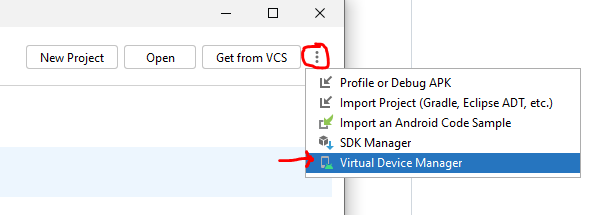

If you installed the AVD along with Android Studio, you should have one device already in your manager. However, we will create another, ensuring it meets the specifications required by Cordova. 

Click 'Create device'. Next, you must select the hardware model you want to emulate. In the Category menu, be sure Phone is selected, then pick a device. The Pixel 4 is a good choice: 

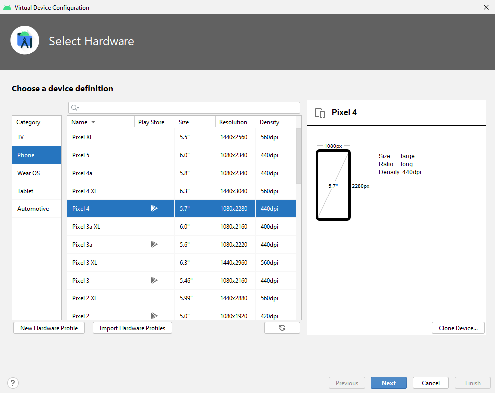

Click 'Next'. On the next screen, you need to choose the system image (essentially a software version). It is important that you **select R (or below)**, as Cordova is only compatible up to Android API Level 30. With R selected, click 'Next'. You may give the device a name on this screen if you wish, or you can accept the default. Click 'Finish.' The new device should now appear in your list of Virtual Devices. Close the AVD Manager. 

Check that the AVD was installed correctly by opening up the SDK Manager (three dot menu > SDK Manager or Configure > SDK Manager). You should see that Android 11.0 (R) is installed. Other versions may also be installed, and that is fine, but if Android 11.0 (API level 30) is _not_ installed, click the checkbox next to it and hit 'Apply'. Click 'OK' to confirm the change and 'Finish' after the installation completes. Close the SDK Manager and close Android Studio. 
 
Note: the screenshot below shows a checkbox next to both Android 11.0 (R) and Android 10.0 (Q). Either version should work (and you are welcome to install both, though this will use extra storage space on your machine), but as R is now the latest Android version supported by Cordova, I recommend using R. 

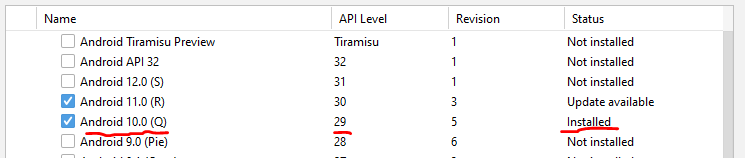

Once you've downloaded Java JDK 8, Gradle, Android Studio, and the Android Virtual Device, it's a good idea to restart your computer. 

### 4. Setting environment variables

Cordova's CLI tools require some environment variables to be set in order to function correctly. Environment variables are dynamic-named values that can affect the way running processes will behave on a computer. You may have experience with setting environments within ArcMap; here, we will set environment variables in the operating system's settings. The Cordova CLI will attempt to set these variables for you, but it is likely you may need to set them manually. The methods for doing this vary significantly between OS X/Linux machines and Windows machines, so I will explain the steps separately for each OS. The variables that we need to set and/or edit include: `JAVA_HOME`, `ANDROID_SDK_ROOT`, and `PATH`. 

#### For Windows 

These exact steps may vary depending on the version of Windows you are running. Please reach out for help if anything in them does not match what you see on your computer or if you have any troubles following these steps. 

1. Click on the **Start** menu in the lower-left corner of the desktop

2. In the search bar, search for **Environment Variables** and select **Edit the system Environment Variables** from the options that appear

3. In the window that appears, click the **Environment Variables** button

4. In the **System Variables** (bottom half of the window), click 'New'

5. In the 'Variable name:' textbox, type JAVA_HOME

6. Click 'Browse Directory'. Here you need to set the value of the JAVA_HOME variable to the location of your Java JDK installation. This *should be* located in your Program Files folder on the C: drive of your computer. Navigate to 'This PC' (or 'My Computer') > 'Windows (C:)' > Program Files > Java > jdk.1.8.0_281, as shown in this screenshot:

   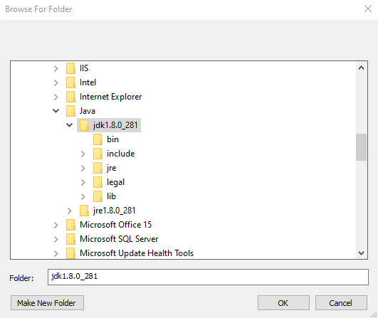

   	*If you cannot find the JDK in this location, please contact me ASAP!*

7. Click OK. The path name should now populate the 'Variable value:' field as show below. Click 'OK.'

   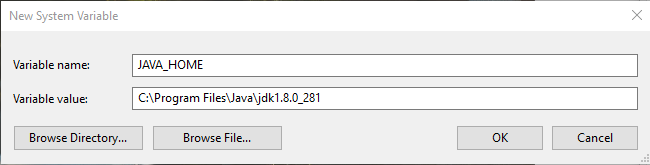

8. Repeat steps 4-7, this time setting a variable named ANDROID_SDK_ROOT with the value set to the location of your Android SDK installation (this should be located in 'C:\Users\[Your User Name]\AppData\Local\Android\Sdk'). 

9. Next, in the list of existing system variables, select 'Path' and click 'Edit'. Click 'New' to add a new path value. 

10. Type ```C:\Gradle\gradle-7.4\bin``` in the new value text box and hit enter. 

    * Alternatively, you can use the 'Browse...' button to navigate to this location. On the C:\ drive,navigate to the folder named Gradle > gradle-7.4> bin

11. Repeat steps 9-10, adding the following path values (replacing [your user] with your own user name in every instance): 

    1. ```C:\Users\[your user]\AppData\Local\Android\Sdk\platform-tools```
    2. ```C:\Users\[your user]\AppData\Local\Android\Sdk\tools```
    3. ```C:\Users\[your user]\AppData\Local\Android\Sdk\tools\bin```
    4. ```JAVA_HOME\bin```

12. Click 'OK' to close the Path window. Click 'OK' again to close the Environment Variables window, and click 'OK' once more to close the System Properties window. 

#### For MacOS X/Linux

For Mac and Linux machines, you can set environment variables using the command line console. This is quite a bit simpler than the Windows steps, though it may not seem like it at first. 

Open your command line terminal and run the following command: 

```
touch ~/.bash_profile; open ~/.bash_profile
```

This should open a document named `.bash_profile` in your default text editor. In that document, add the following: 

```bash
export ANDROID_SDK_ROOT=/Development/android-sdk/
export PATH=${PATH}:/Development/android-sdk/platform-tools:/Development/android-sdk/tools:/opt/gradle/gradle-7.4/bin

```

Save and close your text editor. 

Open a new terminal window and run the following to check that your edits saved correctly: 

```source ~/.bash_profile```

### 5. Test your installation

Open a new instance of the command prompt interface (if yours is open from prior steps, close it and reopen it).

Navigate to your `hello` folder using the `cd` (change directory) command, adding the path name to the location of your folder. 

Run the `cordova requirements` check again: 

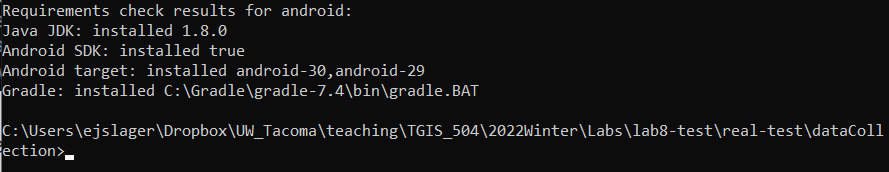

This time, you should get results that look like the above, noting that Java JDK, Android SDK, Android target (Virtual Device), and Gradle are all installed. 

If you do *not* get those results, don't panic. I suggest the following troubleshooting steps: 

1. Close and reopen the command interface, then run the check again.
2. Check that you correctly set your environment settings, without any typos in the variable names or variable values (pathnames). After making any changes to the environment settings, make sure you open a new command console before running the check again.
    * If you are workign on a Windows machine, try setting the environment settings (defining the ANDROID_SDK_ROOT and JAVA_HOME variables and updating the Path    variable) for your User Variables (top half of the window) in the same way you did for the System Variables. After making these changes, open a new command console and run the Cordova requirements check again. 
3. Do a Google search on any error messages you are receiving to see if you can identify the problem and its workarounds. 
4. Consult with peers, especially those who are using the same operating system as you. 
5. Consult with me.

#### 6. Submission

The only thing you need to submit for this lab is a screenshot showing your Cordova requirements check results indicating that you successfully installed Java JDK 8, Android SDK, Android virtual device, and Gradle. Please crop the screenshot so it is legible, and make sure that includes both the path name to your cordova `hello` directory and the full results of the requirements check. Please submit the screenshot on Canvas under the Lab 8 submission link. 

