# Lab 9: Building a hybrid app for Android with Cordova

## TGIS 504, Winter 2022, Dr. Emma Slager

### Introduction

Now that you've set up your Cordova workspace, the next step is to build and customize your app, then package it for distribution. 

In this lab, you will use the Cordova Command Line Interface to build your app for the Android platform, customize it with an icon and splashscreen, test and debug your app, and submit an APK  file of your app on Canvas. You will also write a brief report explaining your process and product, including screenshots and highlights from your app that you can include in your Portfolio to showcase your work to future clients or employers. 

The instructions in this lab are based off of Cordova's documentation, available in [its original form here](https://cordova.apache.org/docs/en/latest/guide/cli/index.html). The exact steps of this lab will depend on your computer's operating system. I have attempted to include instructions for both Windows and OS X below, and although my screenshots will be taken on Windows, I am familiar with both operating systems. If you run into issues or challenges, I encourage you to actively reach out to me for help, to collaborate with peers who are working your same OS, and to use online reference documentation and user message boards to help troubleshoot.

*Technology stack for this lab*

* Node.js 
* Cordova command-line interface (CLI)
* Atom
* Android Virtual Device (mobile device emulator)

### 1. Building your first app

We begin where we left off on Lab 8. Open your command line interface, use `cd` to navigate to your Cordova project folder (`hello`) and run the `cordova requirements` command to ensure again that you are ready to build your app. 

Enter to command `cordova build` to build the skeleton app stored in your `hello` project folder:

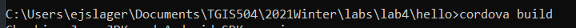

The build process will take a few seconds to complete, but you should eventually get a message that reads `BUILD SUCCESSFUL`:

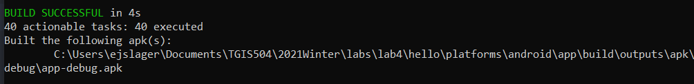

Congratulations! You've built your first app with Cordova. Essentially, what Cordova has done is take the files that you wrote in HTML, JS, and CSS and packaged them as an APK (an Android Package file), which can run on Android mobile operating systems. To do this, it used the platform files you downloaded in Lab 8 using the `cordova platform add android` command, as well as the `config.xml` file created and saved to your `hello` folder when you ran the `cordova create` command, and various other methods and parameters built into the Cordova software itself. 

Open Android Studio, open the Virtual Device Manager (three dot menu > Virtual Device Manager), and click the "Play" icon under 'Actions' to launch your Android Virtual Device emulator--If you have multiple devices in your AVD manager, make sure you launch the device with API v29:

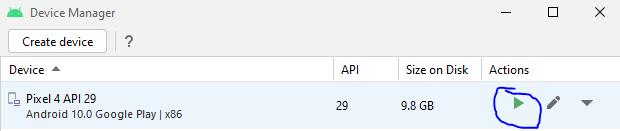

With the emulator launched, return to your command console and enter the following command: 

`cordova emulate android`

This time, you should receive not only a `BUILD SUCCESSFUL` message, but also an `INSTALL SUCCESS` and `LAUNCH SUCCESS` message. 

Return to the emulator window, and your screen should show the following: 

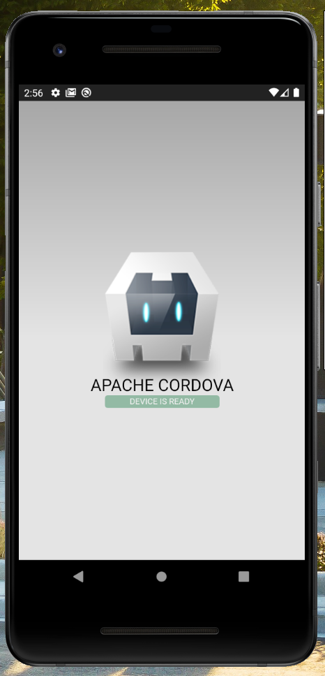

Though there isn't much you can do with this app, it is an app! It is built from the skeleton files stored in the `www` folder inside of the `hello` project folder. 

Click and hold the bottom of the screen, then pull up (similar to swiping up on a touch-screen) to see the full list of apps installed on your emulator. You should see the app name ('HelloWorld') and icon: 

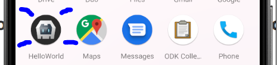 

### 2. Create a new Cordova project to hold your app files

Now that you've built your first test app, let's move on to building a 'real' app. Create a folder to store your 9 files, and navigate to that folder using `cd`. For me, for instance, this looks like this (though the lab number has changed since I first wrote these): 

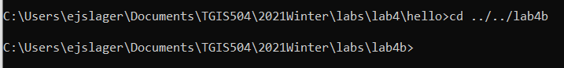

Once in this directory, create a new Cordova project file using the `cordova create` command. the syntax for this command is as follows: 

```
cordova create path [id [name]] 
```

where the `path` is the name you want to give the directory that will hold your project files. For instance, in your first app, you named this `hello`. The directory should not already exist, because Cordova will create this directory. The `id` is a reverse domain-style identifier that you might give a value that resembles `com.appname` where `appname` is replaced with a value appropriate to your project. The `name` is what the application will be titled when it is built. For instance, in your first app, this was named HelloWorld. Give your `path`, `id`, and `name` variables appropriate values and execute the `create` command. For instance, I will give my app the name `Emma`, the id `emmaapp` and store it in a folder with the path `dataCollection`: 

```
cordova create dataCollection com.emmaapp Emma
```

After the create command runs, change your directory so that you are working inside the directory you just created: 

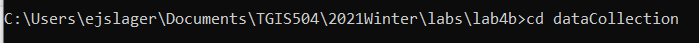

Just as we did in lab 8, we need to add the platforms that we want to build for. Again, we will use Android. Run the following command: 

```
cordova platform add android
```

Run `cordova requirements` to ensure that you are ready to build. You should get a clear requirements check result, just as you did at the very start of these instructions.

### 3. Add your app files to your project directory

The app you are going to build in this lab is a mobile app version of the data collection tool you built in lab 7. Therefore, you next need to copy the files you wrote in lab 7 into your new project directory. These likely include an index.html file, a JavaScript file, and a CSS file, but might also include icon images or other assets. 

In your file manager (File Explorer in Windows or Finder in MacOS), copy (*do not cut*; leave a copy of the files in the original lab 7 folder!) and paste your lab files into the `www` folder inside your newly created project directory. This will mean overwriting the existing index.html file. You do not need to worry about storing your JS file inside the JS folder, or the CSS file inside the CSS folder. Once you've copied your files, your project directory will likely look something like this (the files I just added are highlighted in blue): 

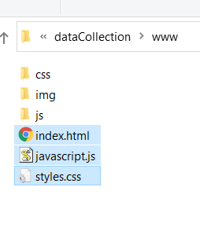

You are now ready to build your app! 

### 4. Build your data collection app

Return to the command line interface and run the `cordova build` command, then the `cordova emulate android` command. 

Open up your Android emulator and you should see the map that you built in lab 7! Test it out to ensure it is working properly. Draw a sample shape, enter some attribute data for it with the text 'Test from Android' and submit it. Log in to your CARTO account and check to see that the sample data saved to your SQL database. Take a screenshot of the CARTO table with your sample point collected and include this screenshot in your lab write up. 

Next, customize your app with a unique icon. By default, your app appears on your emulator device with the Cordova icon. We can customize this using the config.xml file (documentation is available [here](https://cordova.apache.org/docs/en/10.x/config_ref/images.html)). 

First, you should download or create an icon image that you want to use for your app. I recommend you save this image in the PNG image format, and you should save it inside the `www/img` folder in your project directory. Your icon should be square, 256x256 pixels or smaller,  and either of your own creation or an image available under the creative commons or other re-use license. 

Once you've saved your image, navigate in your file explorer to the config.xml file saved inside your project directory. Right click on this to open it in Atom: 

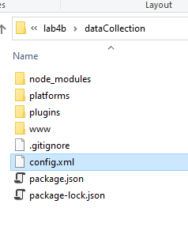

In the config file, add the following code just above the closing `</widget>` tag, making sure to change the value of the `src` attribute to the path and file name of *your* icon: 

```
<icon src="www/img/logoName.png" />
```

Save your file. Back in the command line interface, run the `cordova emulate android` command once again. Pull up from the bottom of the screen to see the list of installed apps and examine your app's icon, and it should use the image you just added. Mine, for example, looks like this: 

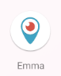

### 5. Add a splashscreen

On your own, using the Cordova documentation, add a splashscreen (image that displays while the app data loads) to your app. You can find the documentation here: https://cordova.apache.org/docs/en/latest/reference/cordova-plugin-splashscreen/index.html.  

The basic steps for this are to: 

1. install the splashscreen plugin using npm in the command line

2. create (or download--using freely licensed images) your splashscreen assets (image files)
   * Note that you should create multiple versions of your splashscreen at different resolutions, because the devices the splashscreen may show on will have different resolutions. This is explained further in the documentation. 
   * We will also spend a little time discussing tricks for building your own splashscreen assets using open-source image editing software in class in Week 10. 
3. update your config.xml file to link to your splashscreen assets

### 6. Build final version 

After building, customizing, and testing your app in the Android emulator, the last step is to build your app in a final version for submission. Once you're satisfied with your app, run the following command: 

```
cordova build --emulator
```

This will produce an APK (Android Package file) that will likely have the name app-debug.apk. We add the --emulator specification to build a file especially optimized to run on an Android emulator, rather than an actual Android device, because that it what I will use to assess your work. The path to this file will be printed to the command line console: 

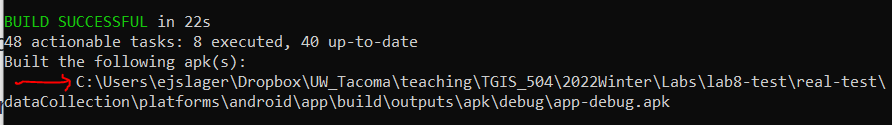

You will upload this APK file to Canvas as part of your submission. In your file manager, navigate to the location specified by the pathname in the command console. Rename the file to something that includes your name, so that I can distinguish it from your peers' when I grade, and take note of where the file is saved so that you can upload the file to Canvas. 

If you were building this for distribution on the Google Play Store, you would specify that the build should be a `--release` build instead of the debug version that you are generating here. However, for the release to be viewable on an Android device, it would also need to be 'signed' with an Android Developer Key. These keys require registering with and paying a fee to the Google Play Store, so we won't use that in this lab. If you want to install the APK on your own Android device, you can do so by downloading the file (you would first want to email it to yourself or upload it to an accessible repository) and opening it to install it. However, you'll first need to change your phone's settings to allow you to install apps downloaded from sources other than the Play Store. Testing your app on a real Android device (as opposed to the emulator you've tested it on so far) is *not* a requirement of this lab, but previous students have asked, so I've included an explanation of the process here. 

### 7. Write up and submission

On Canvas submit the following: 

* A write-up containing 
  * the screenshot of your CARTO table with the 'Test from Android' record saved 
  * A description of your App, including screenshots, written for a public audience. This should be appropriate for including in your Portfolio as an example of your work that you might show to potential clients or employers. 

* The APK for the emulator version of your app (app-debug.apk file, renamed so that I can distinguish it from your classmates' submissions)
* I will award bonus points on a case-by-case basis for particularly effective implementations. 
